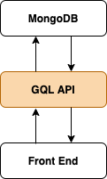

# Extendable, opinionated GraphQL API generator for MongoDB



**Input**

```_collections.js```

<details>
  <summary>Example</summary>  

```
[{
  "collection": "Author",
  "fields": [
    {
      "name": "firstName",
      "type": "String",
    },
    {
      "name": "lastName",
      "type": "String",
    },
    {
      "name": "posts",
      "type": "[Post]",
    },
  ]
}, {
  "collection": "Post",
  "fields": [
    {
      "name": "title",
      "type": "String",
    },
    {
      "name": "author",
      "type": "Author",
    },
    {
      "name": "votes",
      "type": "Int",
    },
  ]
}]
```
</details> 
  
---

**Output**

GQL CRUD API with basic querying capabilities:

- query one
- query all (filter, search, skip, take, sort)
- create
- update
- delete

Check graphiql generated docs for more info

---

**Install MongoDB**

[MongoDB installation manual](https://docs.mongodb.com/manual/installation/)

---

**Set connection string in .env**

```DB_STR=localhost/database-name```

---
**Install npm dependencies**

```npm install```

---

**Run mongodb**

```npm run mongo```

Script to launch mongodb for development  

```
"mongo": "mongod --port 27017 --dbpath ~/data/db"
```

---

**Run in dev mode with nodemon watch-refresh**

```npm run dev```

---

**Run in production mode without nodemon watch-refresh**

```npm run start```

---

## Features

* CRUD generator
* GraphiQL - interface for testing query/mutation requests and generated query/mutation Docs
* Nodemon - restarts dev server after changes are made
* Env variables
* ESM module based
* Polka server (can be easily replaced with express)
* GQL schema stitching
* Monk - MongoDB connector

---

## (F)AQ

<details>
  <summary>Access ... has been blocked by CORS policy ...</summary>

*Error:*

```
Access to XMLHttpRequest at 'http://localhost:4000/graphql' from origin 'http://localhost:3000' has been blocked by CORS policy: Response to preflight request doesn't pass access control check: No 'Access-Control-Allow-Origin' header is present on the requested resource.
```

*Solution:*

Use https://github.com/expressjs/cors middleware for polka server.  
Specify origin that makes requests to GQL API server.  

</details>
