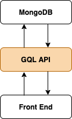

# Extendable, opinionated GraphQL API generator for MongoDB



---

## Features

* [Custom Modules](/doc/custom-modules.md)
* [CRUD Generator](/doc/generator.md)  
* GraphiQL - interface for testing query/mutation requests and generated query/mutation Docs
* Nodemon - restarts dev server after changes are made
* Env variables
* GQL schema stitching
* Monk - MongoDB connector
* [Privileges (in progress)](/doc/api-privileges.md)

---


## Project setup

**Install MongoDB**

[MongoDB installation manual](https://docs.mongodb.com/manual/installation/)

**Set connection string in .env**

```DB_STR=localhost/database-name```

**Install npm dependencies**

```npm install```

**Run mongodb**

```sudo npm run mongo```

Script to launch mongodb for development  

```
"mongo": "mongod --port 27017 --dbpath ~/data/db"
```

**Install npm dependencies**

```npm i```

**Run in dev mode with nodemon watch-refresh**

```npm run dev```

**Run in production mode without nodemon watch-refresh**

```npm run start```

---
 
## (F)AQ

<details>
  <summary>Access ... has been blocked by CORS policy ...</summary>

*Error:*

```
Access to XMLHttpRequest at 'http://localhost:4000/graphql' from origin 'http://localhost:3000' has been blocked by CORS policy: Response to preflight request doesn't pass access control check: No 'Access-Control-Allow-Origin' header is present on the requested resource.
```

*Solution:*

Use https://github.com/expressjs/cors middleware.  
Specify origin that makes requests to GQL API server.  

</details>
 
---

 
## License

[MIT](LICENSE).
