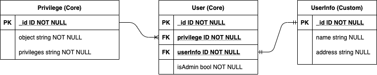

# API Privileges

To enable this feature, set PRIVILEGES to 1 in .env  
To disable this feature, set PRIVILEGES to 0 in .env

[Requests](./api-privileges.http)  

## About

Generator generates API CRUD endpoints which are publicly accessible.

We need some kind of security layer, so only allowed operations can be made by authorized users.

With Privileges enabled:
 - we can tell which object operations (Create, Read, Update, Delete) are allowed to specific users;
 - we can tell which objects can be viewed publicly without logging in;
 - Create, Update, Delete operations are allowed only to logged in users.

With Privileges disabled:
 - only view operations are allowed;
 - Create, Update, Delete operations are disabled.

Use case:

- If .env privileges is set to 1 and there is no existing admin on database, first created user will have admin privileges;
- Only Admin is allowed to create Users and change their privileges to objects;
- As Admin, create User using API schema;
- As Admin, set User privileges to objects. Only allowed object operations can be executed by User.

